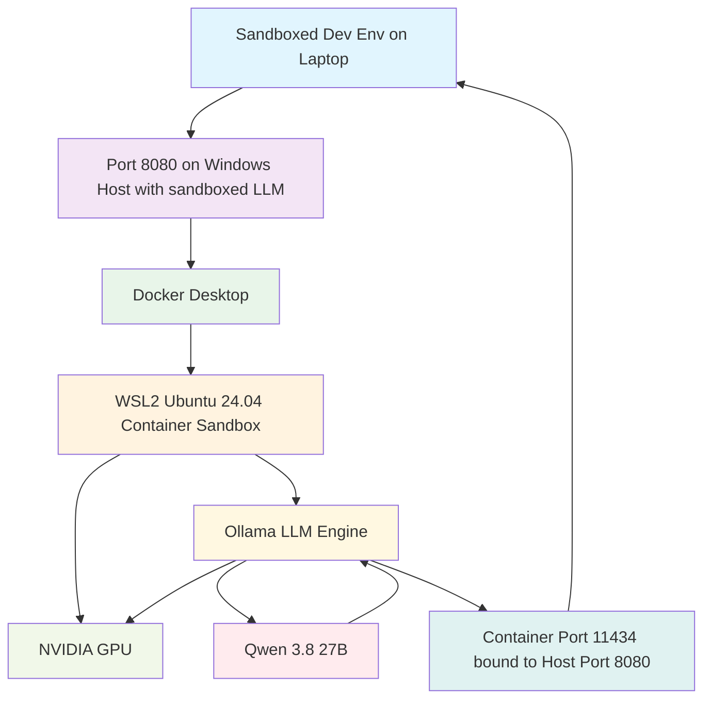

# Local LLM Setup Guide: Hardened Development Environment with Qwen 3

## Overview

This document provides a guide for setting up a secure setup with local Large Language Model (LLM) development environment using Qwen 3.8 27B with GPU acceleration. The setup utilizes Docker containers with WSL2 on Windows host to create an isolated sandboxed environment. Most security achieved when such deployment is used in combination with sandbox-to-sandbox setup, where main development laptop is runnning sandboxed development container for VS code too, and hardening measures, described in the end section of the document.

## Architecture



## System Requirements for LLM host

- 16 GB of local RAM
- Windows 11 with WSL2 support and latest NVIDIA drivers with CUDA 13.3 support
- NVIDIA GPU (RTX 3090 or 4090 recommended as you need a minimum 24GB of VRAM)
- 35-40 GB SSD free space
- Docker Desktop for Windows

Setup like described allows to run Qwen 3.8 27B with 80K tokens context window, configured to use 80K tokens for input and 14K tokens for output. With OLLAMA_NUM_PARALLEL=1, only one request is processed at a time, so the KV cache only needs headroom for output generation (~3-5 GB), not an entire extra context window. Note that this setup can handle context window up to 128K, but it will run very close to max VRAM limits with Q8 cache precision and will often hit the max VRAM on complex tasks. The reduced max context from 128K to 80K provides the required free VRAM safety margin while keeping full Q8 precision for heavy coding tasks. Adequate amount of VRAM you need to keep free after loading model and pre-allocating its context window is around 1.5-2.0GB. To determine which size of context window you can use with your model, you can use script `utility/ctx_sweep.sh` from this repository.

## Setup Process

### Phase 1: Prepare the Windows Host (Prerequisites)

1. **Install NVIDIA Drivers and WSL2**
   - Make sure to install the latest NVIDIA drivers (Cuda 13.3 is supported since versions 580x) to allow GPU communication through the WSL layer.
   - Open PowerShell as Administrator and install WSL2:
     ```powershell
     wsl --install
     ```
   - Restart your PC when prompted.
   - After restart install Ubuntu 24.04 image via:
     ```powershell
     wsl --install -d Ubuntu-24.04
     ```
   - Then you might need to delete the default image and set Ubuntu-24.04 as a default.

2. **Install Docker Desktop**
   - Download and install Docker Desktop for Windows: https://www.docker.com/products/docker-desktop/
   - During installation, ensure the "Use the WSL 2 based engine" option is checked.
   - Open Docker Desktop Settings ➔ General ➔ Check Use the WSL 2 based engine.
   - Go to Resources ➔ WSL Integration ➔ Enable it for your default WSL distribution.

### Phase 2: Create the Dev Container Configuration

Navigate to your local project folder (e.g., D:\Code). Create a hidden directory named `.devcontainer`. Inside this directory, you will create two files: `devcontainer.json` and `Dockerfile`. Also create a folder named "models". We will need it later.

1. **Define the Environment (Dockerfile)**

This file builds a secure Ubuntu environment, installs the NVIDIA CUDA runtime tools, and installs Ollama directly into the isolated workspace.

```dockerfile
FROM nvidia/cuda:13.3.0-runtime-ubuntu24.04

# Prevent interactive prompts during installation
ENV DEBIAN_FRONTEND=noninteractive

# Install essential development utilities explicitly
RUN apt-get update && apt-get install -y --no-install-recommends \
    curl \
    git \
    build-essential \
    ca-certificates \
    gnupg2 \
    zstd \
    sudo \
    && rm -rf /var/lib/apt/lists/*

# Use the official install.sh direct endpoint
RUN curl -fsSL https://ollama.com/install.sh | sh

# Hijack and rename the pre-existing user (UID 1000) to 'coder'
ARG USERNAME=coder
RUN usermod -l $USERNAME ubuntu \
    && groupmod -n $USERNAME ubuntu \
    && usermod -d /home/$USERNAME -m $USERNAME \
    && echo $USERNAME ALL=\(root\) NOPASSWD:ALL > /etc/sudoers.d/$USERNAME \
    && chmod 0440 /etc/sudoers.d/$USERNAME

# Configure global environment variable for Ollama models (both build-time and run-time)
ENV OLLAMA_MODELS=/workspaces/Code/models
ENV OLLAMA_CONTEXT_LENGTH=80000
ENV OLLAMA_HOST=0.0.0.0
ENV OLLAMA_KEEP_ALIVE=24h

EXPOSE 11434

# Fix permissions so both root (during build) and coder (at runtime) can access it
RUN mkdir -p $OLLAMA_MODELS && chown -R $USERNAME:$USERNAME /workspaces/Code/models

USER $USERNAME
WORKDIR /workspace
```

Note: to not pull 20+ GBs every single time, we will store models in persistent folder in our workspace: `/workspaces/Code/models` and will not download it from Dockerfile, we will do it on one of next steps.

2. **Route the GPU and Sandbox Settings (devcontainer.json)**

This file instructs VS Code to build the container, inject your RTX 3090 via Docker's GPU reservations, and automatically provision coding tools.

```json
{
  "name": "Secure Local LLM Coding Sandbox",
  "build": {
    "dockerfile": "Dockerfile"
  },
  "hostRequirements": {
    "gpu": "all"
  },
  "runArgs": [
    "--ipc=host",
    "--mount=type=bind,src=/usr/lib/wsl/drivers,dst=/usr/lib/wsl/drivers,readonly",
    "-p", "0.0.0.0:8080:11434"
  ],
  "containerEnv": {
    "OLLAMA_HOST": "0.0.0.0",
    "OLLAMA_FLASH_ATTENTION": "1",
    "OLLAMA_KV_CACHE_TYPE": "q8_0",
    "OLLAMA_NUM_PARALLEL": "1",
    "OLLAMA_MODELS": "/workspaces/Code/models",
    "OLLAMA_CONTEXT_LENGTH": "80000",
    "OLLAMA_KEEP_ALIVE": "24h",
    "NVIDIA_VISIBLE_DEVICES": "all",
    "NVIDIA_DRIVER_CAPABILITIES": "compute,utility",
    "LD_LIBRARY_PATH": "/usr/lib/wsl/drivers"
  },
  "customizations": {
    "vscode": {
      "extensions": [
        "ms-azuretools.vscode-docker",
        "GitHub.copilot",
        "GitHub.copilot-chat"
      ],
      "settings": {
        "github.copilot.editor.enableAutoCompletions": true
      }
    }
  },
  "remoteUser": "coder"
}
```

Note:

The "--ipc=host" flag prevents memory bottlenecks during high-throughput LLM token generation.
Also note binding of container port 11434 to host system port 8080 and OLLAMA_KEEP_ALIVE set to 24h to not offload the model after some minutes of inactivity.

### Phase 3: Spin Up and Initialize the Sandbox

1. Open Visual Studio Code.
2. Login to GitHub to be able to use Copilot Chat
3. Install the official Dev Containers extension (ms-vscode-remote.remote-containers).
4. Open your project folder (File > Open Folder...).
5. VS Code will detect the configuration files and show a pop-up in the bottom right. Click Reopen in Container.
6. The initial build will pull the base CUDA layers.

### Phase 4: Download models and create a Modelfile to tune up model parameters (one-time)

To not pull 20+ GBs every single time, we store models in persistent folder in our workspace: `/workspaces/Code/models`
But we need to pull these first. As soon as dev container will start up for the first time, open up two new Terminals via Ctrl+Shift+` and issue the commands:

In first terminal:
```bash
ollama serve
```

And leave it running, then in second terminal:
```bash
ollama pull nomic-embed-text
ollama pull qwen3.8:27b
```

Which will pull the models. Then check the contents of `/workspaces/Code/models` - you should see blobs and manifests folders in there.

Now we need to tune up model parameters a bit. Thing is that while Qwen is very capable coding model, on stock settings it's very prone to overthinking things and while doing so, it's often falling into endless reasoning loops with "Wait, let me reconsider..." reasoning about the same sequence of things over and over again, which is very annoying, garbages up the context and requires human interaction to fall out of the reasoning loops. To get rid of this behavior, we need to create a model wrapper in Ollama: custom Modelfile with our own parameters.

Create a folder named `custom` in `/workspaces/Code`, and inside, create the file named `Modelfile` without extension with the following content:

```dockerfile
# Inherit from your installed Qwen 3 model
FROM qwen3.8:27b

# Adjust decoding parameters to break loops
PARAMETER temperature 0.3
PARAMETER top_p 0.95
PARAMETER repeat_penalty 1.08
PARAMETER num_predict 4096

# Define explicit behavioral guardrails
SYSTEM """
You are an expert software engineer. Work out your solution step-by-step. 
Do not repeat previous reasoning steps or restate assumptions unnecessarily. 
If you reach an impasse or identify an error, state the issue once and pivot to an alternative implementation.
"""
```

Here is a breakdown of what each `PARAMETER` does and how well they work together:

`temperature 0.3` - Controls the randomness of the model's output. A higher number (e.g., 0.8) makes the output more creative but chaotic, while a lower number makes it more predictable and focused. Our value (0.3) is a very good setting for technical tasks, coding, or facts. It forces the model to choose highly probable, accurate words, which naturally prevents it from wandering into weird, repetitive loops.

`top_p 0.95` - also known as "nucleus sampling", this filters out the least likely words. The model only considers the top 95% most likely words and ignores the bottom 5% of weird or irrelevant choices. Our value (0.95) is the industry standard. It acts as a safety net. It keeps the model creative enough to sound natural, while your temperature (0.3) keeps it focused.

`repeat_penalty 1.08` - this directly penalizes the model for repeating the exact same words or phrases. A value of 1.0 means no penalty, our value is a perfect gentle nudge. It is high enough to stop the model from getting stuck in an infinite text loops, but low enough that it won't break the formatting of things like code, lists, or standard grammar where repeating words (like "the" or "and") is necessary. If you will need to tune this up, never raise it above 1.12-1.15 or model will be unable to write code, as it will be perceiving syntax elements as a penalized repetitions.

`num_predict 4096` - this sets the maximum number of tokens (roughly 3,000 words) the model is allowed to generate in a single response. Our setting (4096) is very generous. It ensures the model has plenty of room to finish long explanations or complex code blocks without getting abruptly cut off.

And `SYSTEM` prompt works just like a cherry on top of that. With wrapper like above, Qwen still can sometimes fall into the reasoning loop but it happen much less often. Without this wrapper it typically happened for me 10-12 times a day while doing literally anything, while with the wrapper number of such occasions dropped to 1-2 times a day and it happens now only on complex reasoning tasks. 

Now, having a Modelfile let's create a model wrapper:

```bash
ollama create qwen3-coder -f custom/Modelfile
```

This will create a wrapper and will register it as a list of models available in Ollama. This is a very fast operation. Write down the ID of the model you gave to wrapper (`qwen3-coder` in the example above).

Now Ctrl-C the ollama in the first terminal, we're done with this step.

### Phase 5: Starting up

After container startup and having models downloaded, start the ollama like this:
```bash
OLLAMA_CONTEXT_LENGTH=80000 OLLAMA_KV_CACHE_TYPE=q8_0 ollama serve > /tmp/ollama.log 2>&1 & sleep 3 && ollama run qwen3-coder ""
```

This will start ollama and pre-warm the model immediately, as soon as execution finishes you should be able to start working.

Your LLM engine (ollama) should now be running inside the container at http://localhost:11434 and be bound to host system port 8080.

Check if you will be able to see "Ollama is running" via http://<host_system_ip>:8080/

Now, if you need access from VS Code with Copilot extension or Cursor on another machine, add inbound firewall rule for Windows Firewall on host system:

Open Windows Defender Firewall with Advanced Security.
Click Inbound Rules > New Rule...Choose Port > TCP > Specific local ports: 8080.
Choose Allow the connection.
Apply it to Domain and Private profiles, then name it "Ollama LAN Access". Or do via PowerShell:

```powershell
# Configure Windows Firewall rules
New-NetFirewallRule -DisplayName "Ollama LAN Access" -Direction Inbound -Protocol TCP -LocalPort 8080 -Action Allow -Profile Domain,Private
```

Note: if you want to use this setup for production data, connecting to compute node from another machine, like development laptop, make sure to restrict the rule above to only local IP address of your laptop, so that no other machine on your internal network can detect and use this locally running LLM without your permission.

The system is now fully configured. The host system's drives remain hidden from the container, leaving the LLM completely restricted to your isolated folder.
At the same time, LLM execution environment also isolated from host environment. You can try some local prompt now, and while it will run you can verify the GPU status inside the sandbox, in a new terminal within VS Code (`Ctrl+Shift+``):

```bash
nvidia-smi
ollama ps
```

In output you should see ollama as one of the consumers on nvidia-smi, and ollama ps should show your model being run 100% on GPU if all worked as it should.
If ollama splits the load, like 5%CPU/95%GPU this means context window is too big and doesn't fully fits into VRAM together with the model.
It can slow down the whole execution significantly so makes sense to adjust the OLLAMA_CONTEXT_LENGTH value everywhere then to smaller value.

### Phase 6: Configure VS Code & GitHub Copilot access for Client Machines

#### Option 1 (most convenient): GitHub Copilot BYOM feature

This option works best overall. First I've tried this setup with Continue.dev extension, but it's very limited in such setup as extension can't read output of remote terminal calls at the moment - it's not yet implemented. With Microsoft Copilot there's no such limitation, it works perfectly fine with such a setup.

0. Make sure you have logged in to GitHub Copilot. You don't need a paid subcsription so even a free account will work.
1. Open VS Code and make sure you have the GitHub Copilot extension installed (should be installed already as it's defined in devcontainer.json).
2. In Copilot sidebar model selection click "Manage models".
3. Click blue "Add Models" button and Choose "Custom Endpoint". Enter any group name and any random API key. For API type choose "Chat Completions API".
4. This will open a JSON config with empty template, fill in the config section like this:

```json
{
	"name": "Ollama Local",
	"vendor": "customendpoint",
	"apiKey": "${input:chat.lm.secret.-6b58fa7e}",
	"apiType": "chat-completions",
	"models": [
		{
			"id": "qwen3-coder",
			"name": "Qwen 3.8 27B",
			"url": "http://192.168.10.10:8080",
			"toolCalling": true,
			"vision": false,
			"maxInputTokens": 64000,
			"maxOutputTokens": 14000
		}
	]
}
```

Make sure to fill in the "id" parameter matching the one you have downloaded in ollama exactly. In this case it's `qwen3-coder` - custom model wrapper we have created. Add endpoint URL (here "http://192.168.10.10:8080") and don't forget to set model context - here sum of "maxInputTokens" and "maxOutputTokens" should be slightly less than total window set in ollama (80000). "Slightly less" is literal here: note that the whole context window of 80K tokens is not fully allocated. There's a headroom of 2K tokens, and that's intentional. LLM prompt results might slightly vary in size and sometimes can grow a bit larger than allocated buffer limits which will truncate the output in best case, or will cause "request body too big" errors on Copilot side, wasting a perfectly fine formulated answer which you will have to re-calculate again from scratch. So leave as is, and in case you will have more headroom, add it to maxInputTokens instead of maxOutputTokens. 14K maxOutputTokens is around the biggest safe value which can be consumed by Copilot without intermittent issues when communicating with Ollama.

#### Option 2: Cursor extension

Note: This should be possible but I was unable to configure it yet - relevant options are missing in Cursor

1. Open Cursor and click the Gear Icon (Settings) in the top right corner.
2. Navigate to the Models tab on the left sidebar.
3. Scroll down to OpenAI (or find the section for custom endpoints).
4. Click on Override OpenAI Base URL and input your remote server endpoint with the OpenAI API routing suffix:
   ```
   http://192.168.10.10:8080
   ```
5. Enter a dummy API key if required (e.g., ollama).
6. Click Add Model, enter the exact name of your pulled model (e.g., qwen3.8:27b), and toggle it on. Turn off any cloud models you don't intend to use.

## Security Analysis

### Current Security Measures

The setup implements several security controls:
- **Isolated Environment**: Container-based sandbox prevents direct access both ways: to host system from container and to container from host system
- **GPU Isolation**: GPU resources are properly allocated through Docker
- **Network Isolation**: Limited port exposure (11434 mapped to 8080)
- **User Account Separation**: Dedicated coder user with restricted permissions
- **Persistent Model Storage**: Models stored in isolated workspace folder

### Potential Security Gaps and Risks

#### 1. Network Exposure Risk (Medium)
- **Risk**: Port 8080 exposed to host network
- **Impact**: Potential unauthorized access to LLM service
- **Mitigation**: Implement firewall rules and restrict access to specific IPs from which you intend to use this model
- **Risk assesment**: Medium, without access restrictions by IP addresses setup can be dangerous

#### 2. Data Leakage Through Model Usage (Low)
- **Risk**: LLM may inadvertently expose sensitive information from code
- **Impact**: Code snippets, variable names, or project details could be leaked
- **Mitigation**:
  - Use a sandbox-to-sandbox communication setup
  - Monitor and log all interactions
- **Risk assesment**: Low, models optimized for local work, like Qwen 3.8 used in this guide, doesn't typically hold any long-lived persistent data cache, and in this case any cache will remain inside the container

#### 3. Container Escape Risk (Low)
- **Risk**: Potential privilege escalation within container
- **Impact**: Access to host system or other containers
- **Mitigation**:
  - Regular security updates
  - Minimal container privileges
  - Network isolation
- **Risk assesment**: Low, can potenitally be dangerous only when no access restrictions are implemented. Model is running inside the container with reduced permissions under ollama user which has no sudo access and can't execute any dangerous commands on install software packages by it's own initiaitve.

#### 4. Model Storage Security (Negligible with exceptions)
- **Risk**: Models stored in workspace directory
- **Impact**: Unauthorized access to trained models
- **Mitigation**:
  - File system permissions
  - Encryption of sensitive model data
  - Regular backups with access controls
- **Risk assesment**: Negligible with exceptions. Local models, like Qwen 3 used in this guide, are distributed by Ollama's as immutable blobs with known hashsums of every blob. So any tampering with model would be noticeable by changed hashums of its layers, and setup can be improved to verify expected checksums of the model before running it, or even simpler, setting R/O permissions to `/workspaces/Code/models` where models are stored after downloading these. But make sure to not run the custom own proprietary models in this way. In case if you need this setup to work with custom proprietary models, or models you've fine-tuned or trained yourself, these should be placed on a separate attachable volume, which has to be mounted to container in a read-only mode.

### Recommended Hardening Measures

1. **Access Control and Network Security**
   - Implement IP-based access restrictions:
     - Perist the IP of your development laptop (either set to static or reconfigure your router to always assign one same IP to this device) and then re-configure this rule to accept connections only from this IP address.
   - Shutdown this setup when it's not in use:
     - When models are already downloaded and Docker layers cached, spin up of this whole setup takes no more than 10 minutes. Keep it offline when it's not in use.
   - Regular audit of access logs:
     - You can setup ollama to write permanent logs into persistent location

2. **Data Protection**
   - Encrypt sensitive model data at rest:
     - Store working directory and models on BitLocker-encrypted drive
   - Implement data loss prevention policies:
     - To prevent any potential data leaks, use sandbox-to-sandbox communication setup - to connect to this sandboxed LLM service from your laptop, also use a sandboxed containerized dev environment, which will have no acceess to anything on development laptop other than code. This way whole setup will be watertight and will only have access to code and nothing else. For details on setting up sandboxed development environment refer to documents `vs_code_sandbox.md` and `cursor_sandbox.md` in this repository.
     - Any data cached by model in this setup remains inside the container. Wipe the whole container periodically to minimize risks. After initial configuration was done, spin up of such environment takes minutes, so container can be easily wiped out and created from scratch every single day to not have any sensitive data remaining.
   - Regular security scanning of workspace files

3. **Monitoring and Logging**
   - Enable comprehensive logging of all LLM interactions, do not auto-approve tool use
   - Implement real-time monitoring for unusual activities
   - Regular security assessments

## Conclusion

This local LLM setup provides a secure, isolated environment for development work while maintaining access to powerful AI capabilities. The containerized approach ensures that sensitive code remains protected from unauthorized access, and the GPU acceleration enables efficient model execution. However, proper network security measures and monitoring are essential for any production use.

Regular maintenance and security updates should be performed to ensure continued protection against emerging threats.